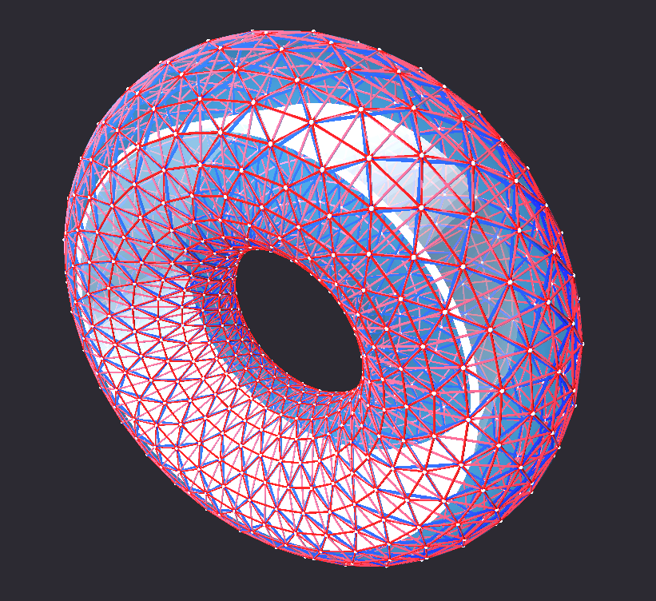

# IslandOne

## Introduction

IslandOne is intended to be an interactive simulation based largely on the mathematics and processes proposed in the final report produced by NASA entitled [Growth Adapted Tensegrity Structures - A New Calculus for the Space Economy](https://www.nasa.gov/content/growth-adapted-tensegrity-structures-a-new-calculus-for-the-space-economy). The name "IslandOne" is derived from the first station mentioned in [The High Frontier: Human Colonies in Space](https://en.wikipedia.org/wiki/The_High_Frontier:_Human_Colonies_in_Space), although that station was spherical in shape and not toroidal. It was also not directly designed to grow in size over time as the growth adapted tensegrity structures are.

The CAD assembly of the tensegrity structure is generated using the CadQuery CAD scripting API, and different sizes of habitat torus (and by extension the rest of the station) can be generated by changing the major and minor radii of the torus, followed by re-exectuing the CadQuery script. This makes it possible to explore the implications of different sizes of the habitat rapidly.

There are two planned sections of the project at this time, with a third being a potential addition in the future.
1. 3D CAD generation of the IslandOne tensegrity torus and the other parts of the island, which are sized based on the central torus.
2. 3D VR (virtual reality) environment (and maybe a standard 3D environment eventually) that is built based on the CAD and can be explored by a user.
3. (Potential) Code infrastructure to allow mathematical analysis of the IslandOne tensegrity torus.

## Current State

Currently only the generated CAD for the tensegrity structure exists, although the 3D environment is still planned. The tensegrity structure as pictured above includes the following components:

1. Tensegrity bars - The blue components are tensegrity bars, 2 per ik unit.
2. Tensegrity strings - The red components are tensegrity strings, 8 per ik unit.
3. Tensegrity nodes - The small white spheres are the nodes that the bars and strings are connected to, modeled in the research as frictionless ball joints.
4. Pressure hull - The current hull is a simple hollow torus that is a stand-in for the final growth-capable pressure hull.
5. Ground deck - This is the main deck that the inhabitants of the island would live and work on. Inhabitants stand on the surface facing the center of the torus, and the rotation of the torus about its central axis simulates gravity.

## Recommended Reading

There are a few publications that have greatly informed the work done on this project.

1. [Growth Adapted Tensegrity Structures - A New Calculus for the Space Economy](https://www.nasa.gov/content/growth-adapted-tensegrity-structures-a-new-calculus-for-the-space-economy) - IslandOne is designed to be an interactive simulation based on the mathematics and systems proposed in the final report of this research.
2. [The High Frontier: Human Colonies in Space](https://en.wikipedia.org/wiki/The_High_Frontier:_Human_Colonies_in_Space) - The book that inspired the research and discovery of resource #1, and the creation of this project. It is also where the name _IslandOne_ comes from. However, it should be noted that the space station bearing the name _Island One_ in the book is spherical in shape not toroidal.
3. [Space Settlements](https://space.nss.org/settlement/nasa/75SummerStudy/Design.html) - A study done by NASA in conjunction with Stanford University where the Standford Torus space station design was proposed. The Growth Adapted Tensegrity Structures concept builds upon and arguably improves that space station design.
